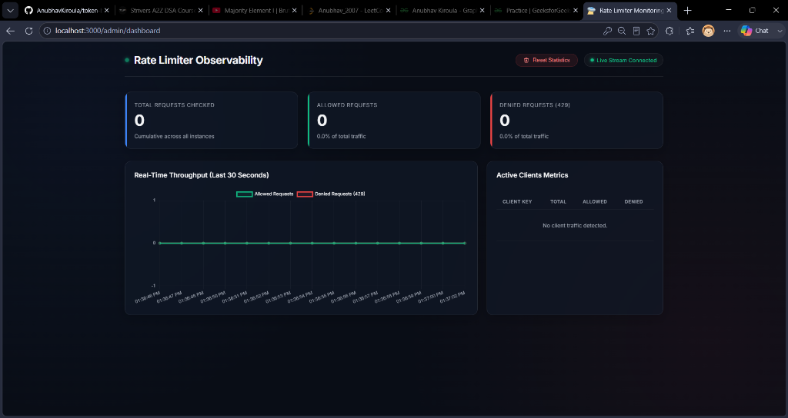

# Token Bucket Rate Limiter Service

[](https://github.com/AnubhavKiroula/token-bucket-rate-limiter-service/actions)

A standalone, production-ready backend service implementing a highly performant and scalable Token Bucket Rate Limiting algorithm. The service features persistence, multi-instance safety (distributed environments), comprehensive testing (unit & integration), and load testing configurations.

---

## 🛠️ Tech Stack

- **Runtime Environment**: Node.js (v22.x)
- **Programming Language**: TypeScript
- **Web Framework**: Express
- **Persistence Store**: Redis (using atomic Lua scripts)
- **Logging / Observability**: Structured JSON logging (Morgan for development HTTP, JSON format for runtime events)
- **Testing Framework**: Jest & Supertest
- **Containerization**: Docker & Docker Compose
- **CI/CD Automation**: GitHub Actions (runs automated build and test pipeline on every push and PR)

---

## 🗺️ Phase Roadmap

- [x] **Phase 1: Repository & Base Structure Initialization**
  - Initialize Node.js, TypeScript, Express, Jest configuration.
  - Implement health check endpoint with logger.
  - Setup CI/CD build & test verification workflows.
- [x] **Phase 2: Core Rate Limiting Implementation**
  - Implement in-memory token bucket rate limiter.
  - Add API endpoints and middleware to apply limits to request paths.
- [x] **Phase 3: Persistence and Distributed Safety**
  - Integrate Redis for multi-instance distributed token bucket synchronization.
  - Ensure thread/concurrency safety (atomic Redis operations via Lua scripting).
  - Implement Basic-Auth-secured `/admin/config` endpoint to persist client-specific overrides.
- [x] **Phase 4: Headers & Load Testing**
  - Expose rate limit status headers on all checks and API endpoints.
  - Configure Artillery load tests simulating 500+ concurrent requests/sec.
  - Build live monitoring telemetry dashboard (`/admin/dashboard`) and JSON analytics endpoint.
- [x] **Phase 5: Dashboard & CI/CD**
  - Refactor metrics endpoint to dedicated routes and enforce Basic Auth.
  - Integrate live metrics reset controls with confirmation modal and toast notifications.
  - Orchestrate Redis service container in GitHub Actions to automate E2E test runs.

## 🌐 Live Demo & Sandbox Testing

This service is deployed in production and can be tested live without any local setup.

### Live URLs:
* **Observability Dashboard**: [https://rate-limiter-service-qa2w.onrender.com/admin/dashboard](https://rate-limiter-service-qa2w.onrender.com/admin/dashboard)
  * *Credentials*: `admin` / `anubhav123`
* **Health Check**: [https://rate-limiter-service-qa2w.onrender.com/health](https://rate-limiter-service-qa2w.onrender.com/health)
* **Metrics Exporter**: [https://rate-limiter-service-qa2w.onrender.com/metrics](https://rate-limiter-service-qa2w.onrender.com/metrics)
  * *Credentials*: `admin` / `anubhav123`

### Sandbox Experiments:

1. **Trigger ALLOW**:
   * Open [https://rate-limiter-service-qa2w.onrender.com/check?key=demo-user](https://rate-limiter-service-qa2w.onrender.com/check?key=demo-user) in your browser.
   * Refresh the tab slowly. You will see `"decision": "ALLOW"` and the remaining token count decrease.
   * Check the live dashboard—you will see allowed request counts increase and the green line on the chart spike.

2. **Trigger DENY**:
   * Open [https://rate-limiter-service-qa2w.onrender.com/check?key=demo-user&capacity=3&refillRate=0.5](https://rate-limiter-service-qa2w.onrender.com/check?key=demo-user&capacity=3&refillRate=0.5) in your browser.
   * *Why this URL?* This overrides the default capacity to 3 and refills only 0.5 tokens/sec (1 token every 2 seconds).
   * Refresh the tab **4 times quickly**.
   * You will see the response change to `"decision": "DENY"`. On the dashboard, the "Denied Requests" count will increase and the red line on the chart will spike.

---

## 🚀 Getting Started

### Prerequisites
Make sure you have [Node.js](https://nodejs.org/) (v20+ recommended), npm, and [Docker](https://www.docker.com/) installed.

### Installation
1. Clone the repository:
   ```bash
   git clone https://github.com/your-username/token-bucket-rate-limiter-service.git
   cd token-bucket-rate-limiter-service
   ```
2. Install dependencies:
   ```bash
   npm install
   ```

### Running the App
- **Development Mode** (requires a local Redis running on port `6379`, with hot reloading via `ts-node-dev`):
  ```bash
  npm run dev
  ```
- **Production Build** (compiles TypeScript):
  ```bash
  npm run build
  ```
  Run the compiled service locally:
  ```bash
  npm start
  ```
- **Docker Multi-Instance Mode** (spins up Redis + `service-1` on port `3000` + `service-2` on port `3001` in a bridge network):
  ```bash
  docker-compose up --build
  ```

---

## 🔌 API Documentation

### 1. Check Rate Limit
Query rate-limiting decisions for any client key.

* **Endpoint**: `/check`
* **Method**: `GET` or `POST`
* **Headers**:
  * `X-Client-Key` (Optional): Unique string representing the client. If not supplied, falls back to IP address.
  * `X-Client-Capacity` (Optional): Override capacity (burst size).
  * `X-Client-Refill-Rate` (Optional): Override refill rate (tokens/sec).

* **Query Parameters**:
  * `key` or `clientKey` (Optional): Alternative way to provide client key.
  * `capacity` (Optional): Alternative way to provide custom capacity.
  * `refillRate` (Optional): Alternative way to provide custom refill rate.

#### Response Headers
* `X-RateLimit-Limit`: The configured maximum capacity.
* `X-RateLimit-Remaining`: Floor value of remaining tokens.
* `X-RateLimit-Reset`: Unix Epoch seconds when the bucket will be completely full again.

#### Response Bodies

##### Decision: ALLOW (HTTP 200 OK)
```json
{
  "decision": "ALLOW",
  "key": "client_1",
  "tokensRemaining": 9,
  "capacity": 10,
  "refillRate": 10,
  "resetTime": 1719438992
}
```

##### Decision: DENY (HTTP 200 OK)
```json
{
  "decision": "DENY",
  "key": "client_1",
  "tokensRemaining": 0,
  "capacity": 10,
  "refillRate": 10,
  "resetTime": 1719439002
}
```

#### Curl Examples
* **Basic Check** (Uses default 10 tokens/sec, burst 10):
  ```bash
  curl -i "http://localhost:3000/check?key=client_1"
  ```
* **Custom Limit Overrides** (Set capacity to 5, refill rate to 2 tokens/sec):
  ```bash
  curl -i "http://localhost:3000/check?key=vip_client&capacity=5&refillRate=2"
  ```
* **Post Request with JSON Body**:
  ```bash
  curl -i -X POST http://localhost:3000/check \
    -H "Content-Type: application/json" \
    -d '{"key": "app_user", "capacity": 20, "refillRate": 5}'
  ```

---

### 2. Configure Client Limits (Admin Only)
Set custom capacity and refill rate configurations for a client, persisted in Redis.

* **Endpoint**: `/admin/config`
* **Method**: `POST`
* **Authentication**: HTTP Basic Auth (Credentials: `ADMIN_USERNAME` / `ADMIN_PASSWORD`, default: `admin` / `secret123`)
* **Headers**:
  * `Authorization`: `Basic <base64-credentials>`
  * `Content-Type`: `application/json`

* **Request Body**:
  ```json
  {
    "key": "vip_user",
    "capacity": 20,
    "refillRate": 5
  }
  ```

* **Response Body (HTTP 200 OK)**:
  ```json
  {
    "success": true,
    "message": "Successfully configured rate limits for client: vip_user",
    "config": {
      "key": "vip_user",
      "capacity": 20,
      "refillRate": 5
    }
  }
  ```

#### Curl Example
```bash
curl -i -X POST -u admin:secret123 \
  -H "Content-Type: application/json" \
  -d '{"key": "vip_user", "capacity": 20, "refillRate": 5}' \
  http://localhost:3000/admin/config
```

---

### 3. Prometheus Metrics Endpoint (Admin Only)
Exposes rates, allowed, and denied counts formatted in standard Prometheus plain text format. Used for scraping by monitoring systems like Prometheus and Grafana.

* **Endpoint**: `/metrics`
* **Method**: `GET`
* **Authentication**: HTTP Basic Auth (Credentials: `ADMIN_USERNAME` / `ADMIN_PASSWORD`, default: `admin` / `secret123`)
* **Headers**:
  * `Authorization`: `Basic <base64-credentials>`
* **Response Content-Type**: `text/plain`

#### Example Output:
```text
# HELP rate_limiter_requests_total The total number of rate limiter requests checked.
# TYPE rate_limiter_requests_total counter
rate_limiter_requests_total 124

# HELP rate_limiter_requests_allowed_total The total number of allowed rate limiter requests.
# TYPE rate_limiter_requests_allowed_total counter
rate_limiter_requests_allowed_total 100

# HELP rate_limiter_requests_denied_total The total number of denied rate limiter requests.
# TYPE rate_limiter_requests_denied_total counter
rate_limiter_requests_denied_total 24

# HELP rate_limiter_client_requests_total The total requests per client.
# TYPE rate_limiter_client_requests_total counter
rate_limiter_client_requests_total{client="client_1"} 100
```

#### Curl Example:
```bash
curl -i -u admin:secret123 http://localhost:3000/metrics
```

---

### 4. Observability Monitoring Dashboard (Admin Only)
A gorgeous, dark-themed, glassmorphic monitoring dashboard powered by Chart.js. Uses Server-Sent Events (SSE) to push live allowed/denied rates and active client statistics to your browser without polling overhead. Includes action triggers to wipe statistics on-demand.

* **Endpoint**: `/admin/dashboard`
* **Method**: `GET`
* **Authentication**: HTTP Basic Auth (`admin` / `secret123`)

Open `http://localhost:3000/admin/dashboard` in your browser to view live charts, client leaderboards, and trigger database-wide metrics reset requests.



---

### 5. Reset Statistics (Admin Only)
Clears all telemetry, request counters, and active client statistics in Redis.

* **Endpoint**: `/admin/stats/reset`
* **Method**: `POST`
* **Authentication**: HTTP Basic Auth (`admin` / `secret123`)

#### Curl Example:
```bash
curl -i -X POST -u admin:secret123 http://localhost:3000/admin/stats/reset
```

---

## 👥 Multi-Instance Coordination Demo

When running the application using Docker Compose, the rate limiting state is fully shared and atomic across multiple server instances thanks to our Redis backend and Lua scripting.

You can verify this shared distributed rate limiting state across `service-1` (port `3000`) and `service-2` (port `3001`):

1. **Configure a client** with small limits via `service-1`:
   ```bash
   curl -X POST -u admin:secret123 \
     -H "Content-Type: application/json" \
     -d '{"key": "demo-client", "capacity": 3, "refillRate": 0.1}' \
     http://localhost:3000/admin/config
   ```

2. **Consume a token** from `service-1`:
   ```bash
   curl -i "http://localhost:3000/check?key=demo-client"
   ```
   *Expected Response Header*: `X-RateLimit-Remaining: 2` (3 capacity minus 1 consumed).

3. **Consume another token** from `service-2` (representing a load-balanced target):
   ```bash
   curl -i "http://localhost:3001/check?key=demo-client"
   ```
   *Expected Response Header*: `X-RateLimit-Remaining: 1` (Shared state reflects the previous consumption).

4. **Exhaust the remaining tokens** from `service-1`:
   ```bash
   curl -i "http://localhost:3000/check?key=demo-client"
   ```
   *Expected Response Header*: `X-RateLimit-Remaining: 0`.

5. **Trigger rate-limiting rejection** from `service-2`:
   ```bash
   curl -i "http://localhost:3001/check?key=demo-client"
   ```
   *Expected Response*: `HTTP/1.1 200 OK` with JSON decision: `"DENY"`.

---

## 🧪 Testing

We use Jest along with Supertest for running unit and mock integration tests on the Express app.

To execute the test suite, run:
```bash
npm test
```

---

## 📈 Load Testing

We use **Artillery** to benchmark the service and prove its correctness under load. The configuration simulates traffic scaling up to **500+ requests/second** using sustained virtual users.

### Run Load Tests

1. Ensure the docker-compose stack is running:
   ```bash
   docker-compose up --build
   ```
2. In a separate terminal, execute the Artillery script:
   ```bash
   npm run test:load
   ```
3. Watch the real-time throughput metrics update dynamically on the dashboard by opening `http://localhost:3000/admin/dashboard` in your browser.

---

## 🔄 CI/CD Automation

This repository integrates automated workflows using **GitHub Actions**:
- **Continuous Integration (`.github/workflows/ci.yml`)**: Spins up a Matrix build across Node.js `18.x`, `20.x`, and `22.x`. It mounts a real containerized Redis alpine service on port 6379, compiles TypeScript source, and executes the entire Jest test suite on every Push and Pull Request targeting `main`.
- **Status Badge**: Configured at the top of the README to indicate the current status of the master branch workflow.

---

## 📄 License

This project is licensed under the MIT License - see the LICENSE file for details.
